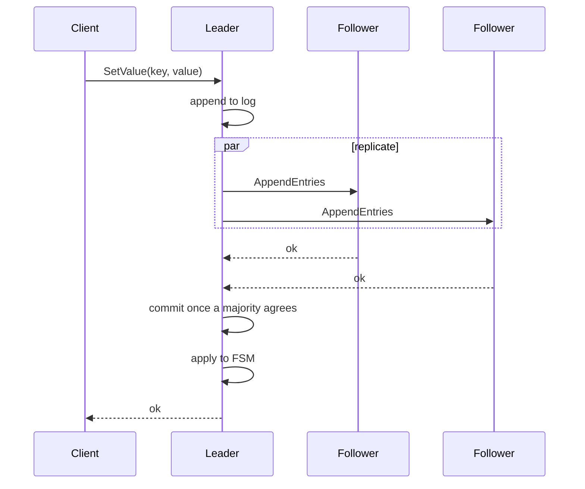
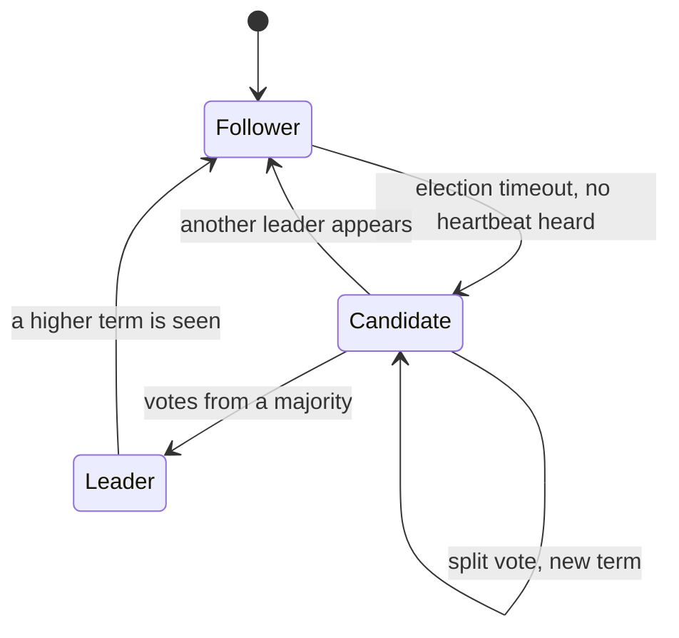

# raft


An implementation of the Raft consensus algorithm in Go, running as a cluster of five nodes
that agree on a replicated key-value store. Leader election, log replication, commit by
majority and persistence across restarts are implemented from the protocol rather than taken
from a library.

## How a write travels

A client sends its command to any node, but only the leader may accept it. The command
enters the leader's log, is replicated to the followers, and is applied to the state machine
only after a majority has written it down. A follower that never hears from a leader starts
an election of its own.



## Roles

Every node is a follower, a candidate or a leader, and moves between the three on timeouts
and votes.



Timings follow the paper. The election timeout is drawn at random between 150 and 300 ms so
that nodes rarely become candidates at the same moment, the leader sends heartbeats every
50 ms, replication runs every 20 ms, and an RPC that does not answer within 100 ms is
abandoned.

## What is stored

| Kept on disk | Why |
|--------------|-----|
| Current term and the vote of this term | A restarted node must not vote twice in one term |
| The command log | It is the record a new leader reconciles against |
| The key-value state | So the machine does not replay the whole log on every start |

## API

The same gRPC service carries the protocol and the client operations.

```proto
service Raft {
  rpc AppendEntries(AppendEntriesReq) returns (AppendEntriesResp);
  rpc RequestVote(RequestVoteReq) returns (RequestVoteResp);

  rpc SetValue(SetValueReq) returns (SetValueResp);
  rpc GetValue(GetValueReq) returns (GetValueResp);
  rpc DeleteValue(DeleteValueReq) returns (DeleteValueResp);
}
```

Writes sent to a node that is not the leader are refused with `ErrNotLeader`.

## Configuration

Each node reads its settings from the environment.

| Variable | Meaning |
|----------|---------|
| `NODE_ADDR` | The address this node listens on |
| `CLUSTER_NODES_ADDR` | Addresses of the other nodes, comma separated |
| `PERSISTENT_DATA_DIR` | Directory for term, vote and log |
| `FSM_DATA_DIR` | Directory for the key-value state |
| `PPROF_ADDR` | Address of the profiling endpoint |
| `LOG_LEVEL` | Log level |

## Running

The example compose file brings up five nodes on ports 4001 to 4005.

```bash
cp docker-compose.example.yaml docker-compose.yaml
make up-cluster
```

```bash
make down-cluster   # stop the cluster
make rm-cluster     # stop it and drop the image
make run-local      # a single node, built and run on the host
```

## Layout

| File | Contents |
|------|----------|
| `raft.go` | Roles, elections, replication, the commit rule |
| `fsm.go` | The key-value state machine and how entries are applied |
| `persistent.go` | Durable term, vote and log |
| `grpc.go` | The gRPC server and the client operations |
| `config.go` | Configuration from the environment |
| `protos/` | The protocol definition and the generated code |

## Reference

Diego Ongaro and John Ousterhout, [In Search of an Understandable Consensus
Algorithm](https://raft.github.io/raft.pdf).
